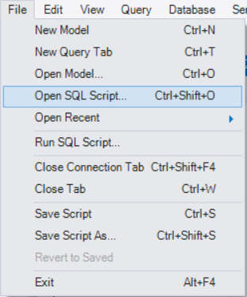
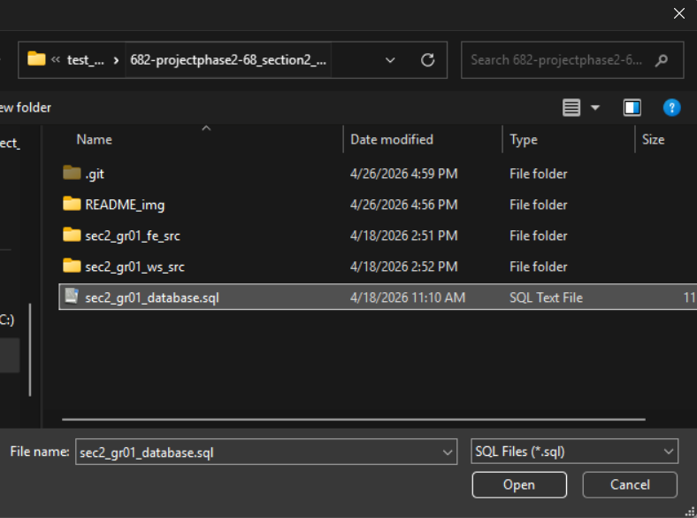
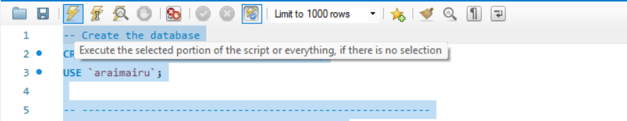
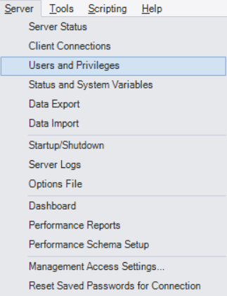
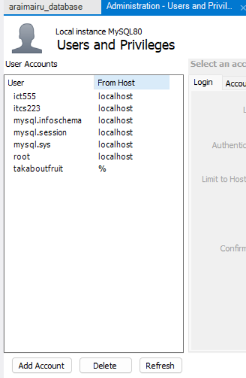
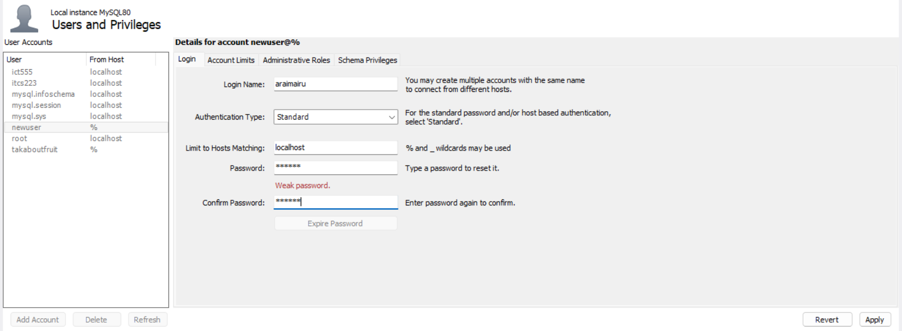
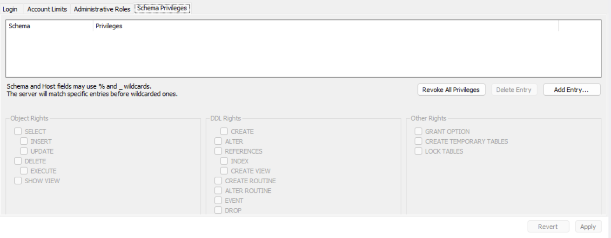
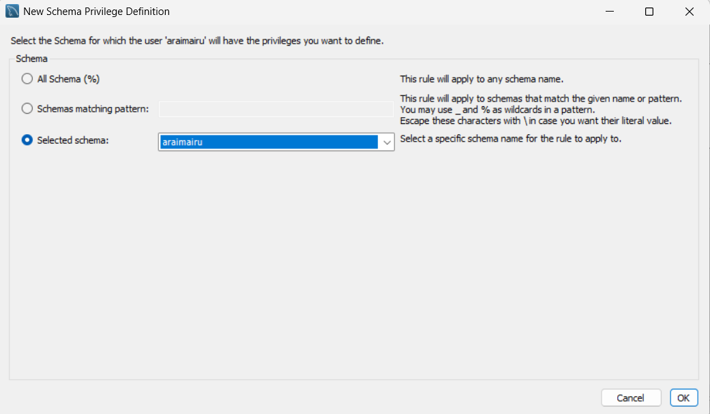
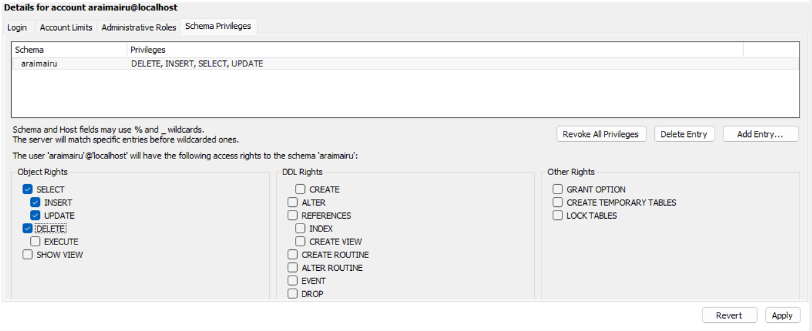
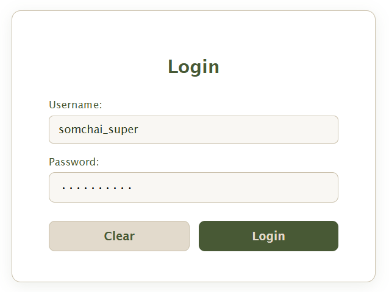

# 682-projectphase2-68_section2_group01

1. Main Submission ([**Click Here**](#main-submission))

2. Extra Score: Deployment ([**Click Here**](#extra-score))

## Main Submission

### How to initialize database, create user, and set permission for database connection

1. On your computer, open MySQL Workbench

2. Connect to Local instance MySQL80


3. Go to File > Open SQL Script > Choose "sec2_gr01_database.sql" file and click Open



4. In the file, press Ctrl+A to select all the code, then press the lightning button to execute the script



5. On MySQL Workbench, go to Server > Users and Privileges



6. On Users and Privileges page, click Add Account button



7. On login page, fill in following information

```
Login name: araimairu
Limit to Hosts Matching: localhost
Password: ict555
Confirm Password: ict555
```



Then, click Apply

8. Go to Schema Privileges. Click Add Entry...
   

9. Choose Selected schema: araimairu



Then, click Ok

10. In Object Rights, check SELECT, INSERT, UPDATE, DELETE



Then, click Apply

### How to start server

#### Frontend Server

```
cd sec2_gr01_fe_src
npm install
npm start
```

#### Web Services Server

```
cd sec2_gr01_ws_src
npm install
npm start
```

After that, you can visit http://localhost:8000

## How to access product management page



Please use the following username and password to login

```
Username: somchai_super
Password: Passw0rd1!
```

---

## Extra Score

### For this project, we used the following tools:
- Render: a cloud platform for deploy our frontend and web services
- Aiven: a service providing a cloud-based MySQL database

### Changes from original code:
- In app.js (web service)

We changed from using createConnection() to createPool(). 

```
let dbConn = mysql.createPool({
    host:     process.env.HOST,
    user:     process.env.DB_USER,
    password: process.env.DB_PASS,
    database: process.env.DB_NAME,
    port:     process.env.DB_PORT,
    waitForConnections: true,
    connectionLimit: 10,
    queueLimit: 0,
    ssl: {
        rejectUnauthorized: false
    }
})
```

We no longer use dbConn.connect, so we comment it out.

```
// dbConn.connect(function(err){
//     if(err) throw err;
//     console.log(`Connected DB: ${process.env.DB_NAME}`)
// })
```

- We modified .env files to connect to Aiven database and upload them directly to Render

```
PORT = 3000

DB_USER = "avnadmin"
DB_PASS = "EXAMPLE_PASSWORD"
DB_NAME = "araimairu"
DB_PORT = 11405
HOST = "EXAMPLE_HOST"

IMGBB_API_KEY = "EXAMPLE_IMGBB_KEY"
```

- We changed API_BASE in javascript part in the frontend from http://localhost:8000 to  https://six82-projectphase2-68-section2-group01.onrender.com/

Note: As we are using free tier of Render, you may need to wait a few minutes for it to work properly.

---

### Link

- Extra Score Repository: [View on GitHub](https://github.com/jinwaratt/682-projectphase2-68_section2_group01_extra-score)
- Link to Frontend: [Visit Deployed Website](https://six82-projectphase2-68-section2-group01-zq3y.onrender.com/)
- Link to Web Service: https://six82-projectphase2-68-section2-group01.onrender.com/
