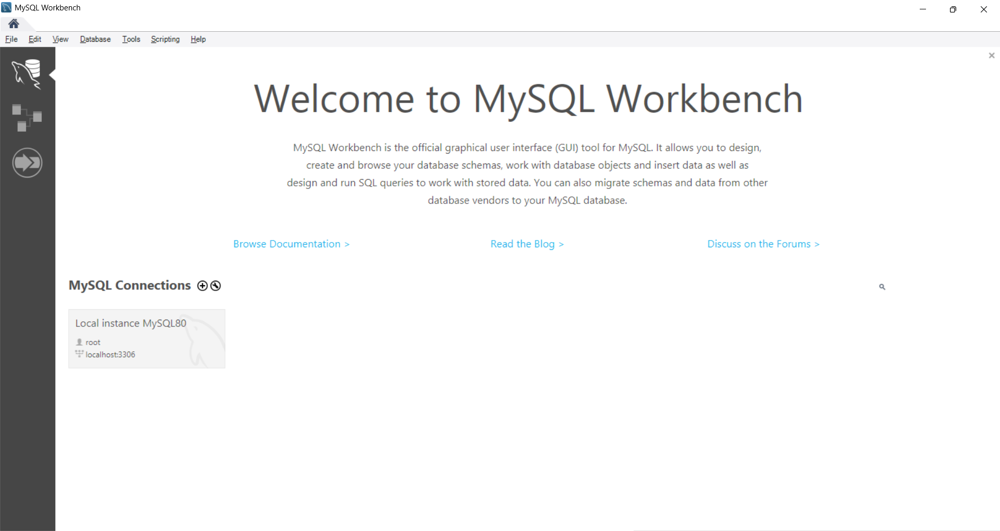
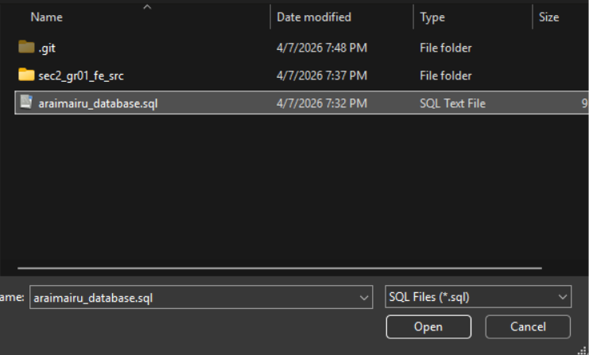

# 682-projectphase2-68_section2_group01

## How to initialize database, create user, and set permission for database connection

1. On your computer, open MySQL Workbench

2. Connect to Local instance MySQL80



3. Go to File > Open SQL Script > Choose "araimairu_database.sql" file and click Open



4. In the file, press Ctrl+A to select all the code, then press the lightning button to execute the script


5. On MySQL Workbench, go to Server > Users and Privileges


6. On Users and Privileges page, click Add Account button


7. On login page, fill in following information

```
Login name: araimairu
Limit to Hosts Matching: localhost
Password: ict555
Confirm Password: ict555
```


Then, click Apply

8. Go to Schema Privileges. Click Add Entry...


9. Choose Selected schema: araimairu


Then, click Ok

10. In Object Rights, check SELECT, INSERT, UPDATE, DELETE


Then, click Apply
